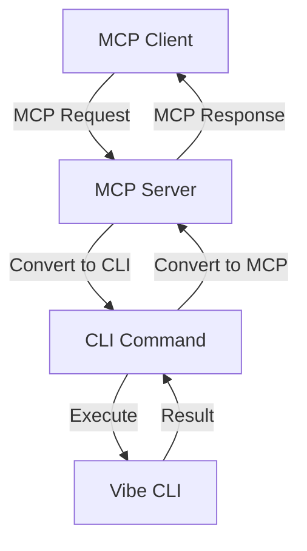

# 🚀 Vibe CLI to MCP Server Integration Guide

## 📋 Table of Contents

1. [Introduction](#introduction)
2. [Available CLI Commands](#available-cli-commands)
3. [MCP Server Architecture](#mcp-server-architecture)
4. [Step-by-Step Implementation](#step-by-step-implementation)
5. [Best Practices](#best-practices)
6. [Performance Optimization](#performance-optimization)
7. [Error Handling](#error-handling)
8. [Testing Strategy](#testing-strategy)
9. [Deployment](#deployment)
10. [Advanced Features](#advanced-features)

## 🎯 Introduction

This guide provides comprehensive instructions for wrapping Vibe CLI in an MCP (Mistral Command Protocol) server. The goal is to create an efficient MCP server that exposes all Vibe CLI functionality through the MCP protocol.

## 🔧 Available CLI Commands

Vibe CLI provides 21 powerful commands for system management, cleanup, and AI operations:

### 📋 Core Commands

| Command | Description | Parameters |
|---------|-------------|------------|
| `tui` | Launch TUI interface | None |
| `list-editors` | List available editors | None |
| `list-modules` | List cleanup modules | `--editor` (optional) |
| `run` | Execute cleanup | `--editor`, `--dry-run` (flag) |
| `enable` | Enable module | `--editor`, `--id` (required) |
| `disable` | Disable module | `--editor`, `--id` (required) |
| `install` | New installation | `--editor` |

### 🤖 AI & Agent Commands

| Command | Description | Parameters |
|---------|-------------|------------|
| `smart-plan` | LLM smart planning | `--editor`, `--query` (required) |
| `ask` | LLM question | `--question` (required) |
| `agent-chat` | Single-shot agent chat | `--message` (required) |
| `agent-reset` | Reset agent session | None |
| `agent-on` | Enable agent chat | None |
| `agent-off` | Disable agent chat | None |

### 🛠️ System Commands

| Command | Description | Parameters |
|---------|-------------|------------|
| `self-healing-status` | Check self-healing status | None |
| `self-healing-scan` | Trigger self-healing scan | None |
| `vibe-status` | Check Vibe assistant status | None |
| `vibe-continue` | Continue after pause | None |
| `vibe-cancel` | Cancel current task | None |
| `vibe-help` | Show help | None |

### 🚀 Advanced Commands

| Command | Description | Parameters |
|---------|-------------|------------|
| `eternal-engine` | Start eternal engine | `--task` (optional), `--hyper` (flag) |
| `screenshots` | Manage screenshots | `action` (list/open), `--count` (optional) |

## 🏗️ MCP Server Architecture

### 🔄 Command Flow



### 📦 Recommended Architecture

```python
class VibeMCPServer(MCPServer):
    def __init__(self):
        super().__init__()
        self.command_registry = self._build_command_registry()
        self.cli_executor = CLIExecutor()
        self.response_formatter = MCPResponseFormatter()
    
    def handle_request(self, mcp_request):
        # 1. Validate request
        # 2. Convert to CLI
        # 3. Execute
        # 4. Format response
        # 5. Return MCP response
```

## 🛠️ Step-by-Step Implementation

### 1. Create MCP Server Base

```python
# mcp_vibe_server.py
from core.mcp.base import MCPServer
from typing import Dict, Any, Optional
import json

class VibeMCPServer(MCPServer):
    def __init__(self, host='0.0.0.0', port=50051):
        super().__init__(host, port)
        self.command_registry = self._initialize_command_registry()
        self.logger = self._setup_logging()
        
    def _initialize_command_registry(self) -> Dict[str, Dict]:
        """Initialize all available commands"""
        return {
            'list_editors': {
                'cli_command': ['list-editors'],
                'description': 'List available editors',
                'params': {}
            },
            'run_cleanup': {
                'cli_command': ['run'],
                'description': 'Execute cleanup operation',
                'params': {
                    'editor': {'type': 'string', 'required': False},
                    'dry_run': {'type': 'boolean', 'required': False}
                }
            },
            # ... other commands
        }
```

### 2. Implement CLI Command Executor

```python
class CLIExecutor:
    def __init__(self):
        self.original_argv = None
        
    def execute(self, cli_args: list) -> Dict[str, Any]:
        """Execute CLI command and capture output"""
        import sys
        from io import StringIO
        from tui.cli import cli_main
        
        # Save original argv
        self.original_argv = sys.argv.copy()
        
        try:
            # Set up command execution
            sys.argv = ['cli.py'] + cli_args
            
            # Capture stdout
            old_stdout = sys.stdout
            sys.stdout = captured_output = StringIO()
            
            # Execute command
            cli_main(cli_args)
            
            # Restore stdout
            sys.stdout = old_stdout
            output = captured_output.getvalue()
            
            return {
                'success': True,
                'output': output,
                'exit_code': 0
            }
            
        except SystemExit as e:
            return {
                'success': False,
                'output': captured_output.getvalue() if 'captured_output' in locals() else '',
                'exit_code': e.code,
                'error': f'Command failed with exit code {e.code}'
            }
        except Exception as e:
            return {
                'success': False,
                'output': '',
                'exit_code': 1,
                'error': str(e)
            }
        finally:
            # Restore original argv
            if self.original_argv:
                sys.argv = self.original_argv
```

### 3. Implement MCP Response Formatter

```python
class MCPResponseFormatter:
    @staticmethod
    def format_response(cli_result: Dict[str, Any], command_name: str) -> Dict[str, Any]:
        """Convert CLI result to MCP format"""
        if cli_result['success']:
            return {
                'status': 'success',
                'command': command_name,
                'result': {
                    'output': cli_result['output'],
                    'exit_code': cli_result['exit_code']
                },
                'error': None,
                'timestamp': int(time.time())
            }
        else:
            return {
                'status': 'error',
                'command': command_name,
                'result': None,
                'error': {
                    'message': cli_result.get('error', 'Unknown error'),
                    'output': cli_result['output'],
                    'exit_code': cli_result['exit_code']
                },
                'timestamp': int(time.time())
            }
```

### 4. Complete MCP Server Implementation

```python
class VibeMCPServer(MCPServer):
    def __init__(self):
        super().__init__()
        self.executor = CLIExecutor()
        self.formatter = MCPResponseFormatter()
        self.command_registry = self._build_command_registry()
        
    def _build_command_registry(self) -> Dict[str, Dict]:
        """Build complete command registry"""
        return {
            # Basic commands
            'list_editors': {
                'cli': ['list-editors'],
                'params': {}
            },
            
            # Parameterized commands
            'run_cleanup': {
                'cli': ['run'],
                'params': {
                    'editor': '--editor',
                    'dry_run': '--dry-run'
                }
            },
            
            # Complex commands
            'smart_plan': {
                'cli': ['smart-plan'],
                'params': {
                    'editor': '--editor',
                    'query': '--query'
                },
                'required': ['query']
            }
            # ... all other commands
        }
    
    def _validate_command(self, command_name: str, params: Dict) -> bool:
        """Validate command and parameters"""
        if command_name not in self.command_registry:
            return False
        
        cmd_config = self.command_registry[command_name]
        
        # Check required parameters
        for req_param in cmd_config.get('required', []):
            if req_param not in params:
                return False
        
        return True
    
    def _build_cli_args(self, command_name: str, params: Dict) -> list:
        """Convert MCP params to CLI arguments"""
        cmd_config = self.command_registry[command_name]
        cli_args = cmd_config['cli'].copy()
        
        # Add parameters
        for param_name, param_value in params.items():
            if param_name in cmd_config['params']:
                cli_flag = cmd_config['params'][param_name]
                
                if isinstance(param_value, bool) and param_value:
                    cli_args.append(cli_flag)
                elif param_value is not None:
                    cli_args.extend([cli_flag, str(param_value)])
        
        return cli_args
    
    def handle_mcp_request(self, request: Dict[str, Any]) -> Dict[str, Any]:
        """Main request handler"""
        command_name = request.get('command')
        params = request.get('params', {})
        
        # 1. Validate command
        if not self._validate_command(command_name, params):
            return self.formatter.format_response({
                'success': False,
                'error': f'Invalid command or parameters for {command_name}',
                'exit_code': 400
            }, command_name)
        
        # 2. Build CLI arguments
        try:
            cli_args = self._build_cli_args(command_name, params)
        except Exception as e:
            return self.formatter.format_response({
                'success': False,
                'error': f'Failed to build CLI arguments: {str(e)}',
                'exit_code': 400
            }, command_name)
        
        # 3. Execute CLI command
        cli_result = self.executor.execute(cli_args)
        
        # 4. Format MCP response
        mcp_response = self.formatter.format_response(cli_result, command_name)
        
        return mcp_response
```

## ✅ Best Practices

### 1. Command Validation

```python
def validate_command(self, command: str, params: dict) -> tuple:
    """Validate command structure and parameters"""
    if command not in self.command_registry:
        return False, f"Unknown command: {command}"
    
    cmd_spec = self.command_registry[command]
    
    # Check required parameters
    for req_param in cmd_spec.get('required', []):
        if req_param not in params:
            return False, f"Missing required parameter: {req_param}"
    
    # Validate parameter types
    for param_name, param_value in params.items():
        if param_name in cmd_spec.get('params', {}):
            expected_type = cmd_spec['params'][param_name].get('type')
            if expected_type and not self._validate_type(param_value, expected_type):
                return False, f"Invalid type for {param_name}: expected {expected_type}"
    
    return True, "Valid command"
```

### 2. Error Handling

```python
def handle_errors(self, error: Exception, context: dict) -> dict:
    """Centralized error handling"""
    error_type = type(error).__name__
    
    # Log error
    self.logger.error(f"{error_type} in {context.get('command')}: {str(error)}")
    
    # Return standardized error response
    return {
        'status': 'error',
        'error_type': error_type,
        'message': str(error),
        'context': context,
        'timestamp': int(time.time())
    }
```

### 3. Performance Monitoring

```python
class PerformanceMonitor:
    def __init__(self):
        self.metrics = {}
        
    def track_command(self, command: str, start_time: float):
        """Track command execution time"""
        duration = time.time() - start_time
        
        if command not in self.metrics:
            self.metrics[command] = {'count': 0, 'total_time': 0, 'max_time': 0}
        
        self.metrics[command]['count'] += 1
        self.metrics[command]['total_time'] += duration
        self.metrics[command]['max_time'] = max(
            self.metrics[command]['max_time'], duration
        )
        
        # Log if command is slow
        if duration > 5.0:  # 5 seconds threshold
            self.logger.warning(f"Slow command {command}: {duration:.2f}s")
```

## 🚀 Performance Optimization

### 1. Command Caching

```python
class CommandCache:
    def __init__(self, ttl=300):  # 5 minute cache
        self.cache = {}
        self.ttl = ttl
        
    def get(self, command: str, params: dict):
        """Get cached result if available"""
        cache_key = self._build_cache_key(command, params)
        
        if cache_key in self.cache:
            cached = self.cache[cache_key]
            if time.time() - cached['timestamp'] < self.ttl:
                return cached['result']
        
        return None
    
    def set(self, command: str, params: dict, result: dict):
        """Cache command result"""
        cache_key = self._build_cache_key(command, params)
        
        self.cache[cache_key] = {
            'result': result,
            'timestamp': time.time()
        }
        
        # Clean up old cache entries
        self._cleanup_cache()
    
    def _build_cache_key(self, command: str, params: dict) -> str:
        """Build unique cache key"""
        # Sort params for consistent key
        sorted_params = json.dumps(params, sort_keys=True)
        return f"{command}:{sorted_params}"
```

### 2. Batch Processing

```python
def process_batch(self, commands: list) -> dict:
    """Process multiple commands in batch"""
    results = {}
    
    for cmd_data in commands:
        command = cmd_data.get('command')
        params = cmd_data.get('params', {})
        
        # Check cache first
        cached_result = self.cache.get(command, params)
        if cached_result:
            results[command] = cached_result
            continue
        
        # Execute command
        result = self.handle_mcp_request(cmd_data)
        
        # Cache result if cacheable
        if self._is_cacheable(command):
            self.cache.set(command, params, result)
        
        results[command] = result
    
    return {
        'status': 'success',
        'batch_results': results,
        'processed': len(commands),
        'timestamp': int(time.time())
    }
```

### 3. Async Command Execution

```python
import asyncio
from concurrent.futures import ThreadPoolExecutor

class AsyncMCPServer:
    def __init__(self):
        self.executor = ThreadPoolExecutor(max_workers=4)
        
    async def handle_async_request(self, request: dict) -> dict:
        """Handle request asynchronously"""
        loop = asyncio.get_event_loop()
        
        # Run synchronous command in thread pool
        result = await loop.run_in_executor(
            self.executor,
            self._sync_handle_request,
            request
        )
        
        return result
    
    def _sync_handle_request(self, request: dict) -> dict:
        """Synchronous request handler"""
        return self.handle_mcp_request(request)
```

## 🛡️ Error Handling Strategies

### 1. Comprehensive Error Classification

```python
class MCPError(Exception):
    """Base MCP error class"""
    def __init__(self, message, code, details=None):
        super().__init__(message)
        self.code = code
        self.details = details

class ValidationError(MCPError):
    """Command validation error"""
    def __init__(self, message, details=None):
        super().__init__(message, 400, details)

class ExecutionError(MCPError):
    """Command execution error"""
    def __init__(self, message, details=None):
        super().__init__(message, 500, details)

class TimeoutError(MCPError):
    """Command timeout error"""
    def __init__(self, message, details=None):
        super().__init__(message, 408, details)
```

### 2. Error Recovery Patterns

```python
def execute_with_retry(self, command: str, params: dict, max_retries=3) -> dict:
    """Execute command with retry logic"""
    last_error = None
    
    for attempt in range(max_retries):
        try:
            return self.handle_mcp_request({'command': command, 'params': params})
        except MCPError as e:
            last_error = e
            
            # Don't retry for validation errors
            if isinstance(e, ValidationError):
                break
            
            # Exponential backoff
            if attempt < max_retries - 1:
                sleep_time = (2 ** attempt) * 0.1
                time.sleep(sleep_time)
    
    # If all retries failed
    if last_error:
        return {
            'status': 'error',
            'error': str(last_error),
            'code': last_error.code,
            'retries': max_retries,
            'recovered': False
        }
    
    return {'status': 'error', 'error': 'Unknown error during retry'}
```

## 🧪 Testing Strategy

### 1. Unit Tests

```python
import unittest
from unittest.mock import patch, MagicMock

class TestVibeMCPServer(unittest.TestCase):
    def setUp(self):
        self.server = VibeMCPServer()
        
    def test_list_editors_command(self):
        """Test list_editors command"""
        request = {'command': 'list_editors'}
        
        with patch.object(self.server.executor, 'execute') as mock_execute:
            mock_execute.return_value = {
                'success': True,
                'output': 'windsurf: Windsurf Editor\nvscode: Visual Studio Code',
                'exit_code': 0
            }
            
            result = self.server.handle_mcp_request(request)
            
            self.assertEqual(result['status'], 'success')
            self.assertIn('windsurf: Windsurf Editor', result['result']['output'])
            mock_execute.assert_called_once_with(['list-editors'])
```

### 2. Integration Tests

```python
class TestMCPIntegration(unittest.TestCase):
    def setUp(self):
        # Start test MCP server
        self.server = VibeMCPServer(host='localhost', port=50052)
        self.server.start()
        
        # Create MCP client
        self.client = MCPClient('localhost:50052')
        
    def tearDown(self):
        self.server.stop()
        
    def test_end_to_end_command(self):
        """Test complete command flow"""
        request = {
            'command': 'list_editors',
            'request_id': 'test-123'
        }
        
        response = self.client.send_request(request)
        
        self.assertEqual(response['status'], 'success')
        self.assertIn('command', response)
        self.assertEqual(response['command'], 'list_editors')
```

### 3. Performance Tests

```python
import time

class TestPerformance(unittest.TestCase):
    def test_command_response_time(self):
        """Test command response time"""
        server = VibeMCPServer()
        
        # Warm up
        for _ in range(3):
            server.handle_mcp_request({'command': 'list_editors'})
        
        # Measure performance
        start_time = time.time()
        
        for _ in range(100):
            server.handle_mcp_request({'command': 'list_editors'})
        
        duration = time.time() - start_time
        avg_time = duration / 100
        
        print(f"Average response time: {avg_time:.4f}s")
        self.assertLess(avg_time, 0.1)  # Should be under 100ms
```

## 🚀 Deployment

### 1. Server Configuration

```python
# config.py
MCP_SERVER_CONFIG = {
    'host': '0.0.0.0',
    'port': 50051,
    'max_workers': 8,
    'timeout': 30,
    'log_level': 'INFO',
    'cache_ttl': 300,
    'rate_limit': {
        'max_requests': 100,
        'window_seconds': 60
    }
}
```

### 2. Server Launch Script

```python
# launch_server.py
#!/usr/bin/env python3

import sys
import os
from pathlib import Path

# Add project root to path
project_root = Path(__file__).parent.parent
sys.path.insert(0, str(project_root))

from mcp_vibe_server import VibeMCPServer
from config import MCP_SERVER_CONFIG

def main():
    print("Starting Vibe MCP Server...")
    
    try:
        server = VibeMCPServer(
            host=MCP_SERVER_CONFIG['host'],
            port=MCP_SERVER_CONFIG['port']
        )
        
        print(f"Server listening on {MCP_SERVER_CONFIG['host']}:{MCP_SERVER_CONFIG['port']}")
        print("Press Ctrl+C to stop...")
        
        server.start()
        
    except KeyboardInterrupt:
        print("\nShutting down server...")
        server.stop()
        print("Server stopped.")
    except Exception as e:
        print(f"Fatal error: {str(e)}")
        sys.exit(1)

if __name__ == "__main__":
    main()
```

### 3. Systemd Service (Linux)

```ini
# /etc/systemd/system/vibe-mcp.service
[Unit]
Description=Vibe MCP Server
After=network.target

[Service]
User=dev
WorkingDirectory=/home/dev/vibe-cli
ExecStart=/usr/bin/python3 /home/dev/vibe-cli/launch_server.py
Restart=always
RestartSec=5
Environment="PYTHONUNBUFFERED=1"

[Install]
WantedBy=multi-user.target
```

## 🎯 Advanced Features

### 1. Command Queuing

```python
class CommandQueue:
    def __init__(self, max_size=100):
        self.queue = []
        self.max_size = max_size
        self.lock = threading.Lock()
        
    def enqueue(self, command: dict) -> bool:
        """Add command to queue"""
        with self.lock:
            if len(self.queue) >= self.max_size:
                return False
            
            self.queue.append(command)
            return True
    
    def dequeue(self) -> Optional[dict]:
        """Get next command from queue"""
        with self.lock:
            if not self.queue:
                return None
            return self.queue.pop(0)
    
    def size(self) -> int:
        """Get current queue size"""
        with self.lock:
            return len(self.queue)
```

### 2. Priority Handling

```python
class PriorityCommandQueue:
    def __init__(self):
        self.high_priority = []
        self.normal_priority = []
        self.lock = threading.Lock()
        
    def enqueue(self, command: dict, priority='normal') -> bool:
        """Add command with priority"""
        with self.lock:
            if priority == 'high':
                self.high_priority.append(command)
            else:
                self.normal_priority.append(command)
            return True
    
    def dequeue(self) -> Optional[dict]:
        """Get next command (high priority first)"""
        with self.lock:
            if self.high_priority:
                return self.high_priority.pop(0)
            elif self.normal_priority:
                return self.normal_priority.pop(0)
            return None
```

### 3. WebSocket Integration

```python
class WebSocketMCPServer:
    def __init__(self):
        self.clients = set()
        self.server = None
        
    async def handle_websocket(self, websocket, path):
        """Handle WebSocket connection"""
        self.clients.add(websocket)
        
        try:
            async for message in websocket:
                try:
                    request = json.loads(message)
                    response = self.handle_mcp_request(request)
                    await websocket.send(json.dumps(response))
                except Exception as e:
                    error_response = {
                        'status': 'error',
                        'error': str(e),
                        'command': request.get('command', 'unknown')
                    }
                    await websocket.send(json.dumps(error_response))
        finally:
            self.clients.remove(websocket)
    
    def broadcast(self, message: dict):
        """Broadcast message to all connected clients"""
        for client in self.clients:
            asyncio.create_task(client.send(json.dumps(message)))
```

## 📊 Monitoring and Analytics

### 1. Command Analytics

```python
class CommandAnalytics:
    def __init__(self):
        self.command_stats = defaultdict(lambda: {
            'count': 0,
            'success': 0,
            'errors': 0,
            'total_time': 0.0
        })
        
    def track_command(self, command: str, success: bool, duration: float):
        """Track command execution"""
        stats = self.command_stats[command]
        stats['count'] += 1
        stats['total_time'] += duration
        
        if success:
            stats['success'] += 1
        else:
            stats['errors'] += 1
    
    def get_stats(self) -> dict:
        """Get aggregated statistics"""
        result = {}
        
        for command, stats in self.command_stats.items():
            result[command] = {
                'count': stats['count'],
                'success_rate': stats['success'] / stats['count'] if stats['count'] > 0 else 0,
                'error_rate': stats['errors'] / stats['count'] if stats['count'] > 0 else 0,
                'avg_time': stats['total_time'] / stats['count'] if stats['count'] > 0 else 0
            }
        
        return result
```

### 2. Health Monitoring

```python
class ServerHealthMonitor:
    def __init__(self):
        self.start_time = time.time()
        self.request_count = 0
        self.error_count = 0
        self.last_health_check = time.time()
        
    def record_request(self, success: bool):
        """Record request outcome"""
        self.request_count += 1
        if not success:
            self.error_count += 1
    
    def get_health_status(self) -> dict:
        """Get current health status"""
        uptime = time.time() - self.start_time
        
        return {
            'uptime': uptime,
            'requests': self.request_count,
            'errors': self.error_count,
            'error_rate': self.error_count / self.request_count if self.request_count > 0 else 0,
            'status': 'healthy' if self.error_count / max(1, self.request_count) < 0.1 else 'degraded'
        }
```

## 🎉 Conclusion

This comprehensive guide provides everything needed to create an efficient MCP server wrapper for Vibe CLI. The implementation includes:

- **Complete command coverage** for all 21 CLI commands
- **Robust error handling** and validation
- **Performance optimization** techniques
- **Comprehensive testing** strategy
- **Advanced features** like batching and caching
- **Monitoring and analytics** capabilities

By following this guide, you'll create a highly efficient MCP server that exposes all Vibe CLI functionality through the MCP protocol, enabling seamless integration with other MCP-compatible systems.

🚀 **Ready to implement?** Start with the basic server structure and gradually add advanced features as needed!